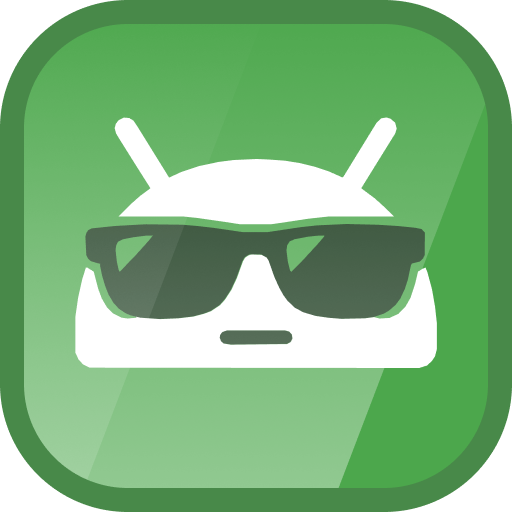
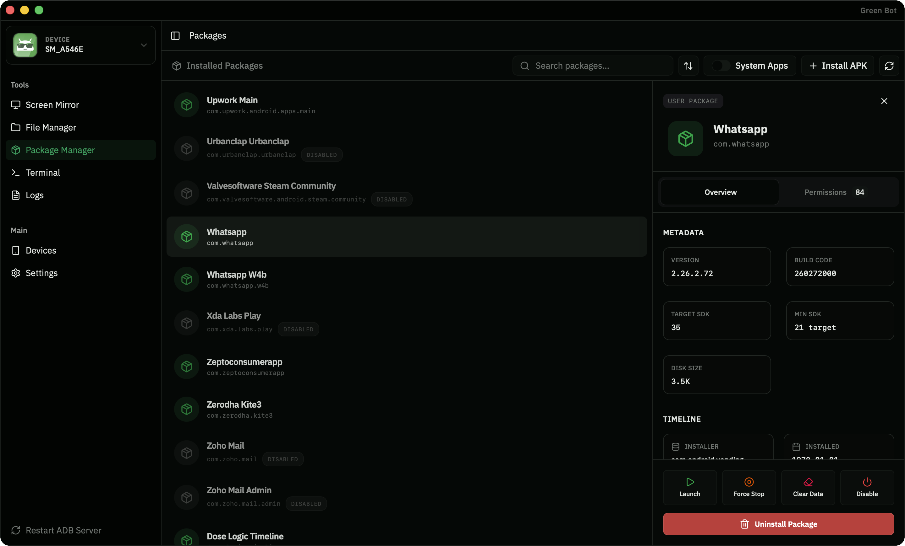

# Green Bot 🤖

<div align="center">
  
  
  <h3>Manage your Android devices without the bloat.</h3>

  <p>
    A lightweight, standalone tool for device management, file transfer, screen mirroring, and more.<br/>
    <strong>No Android Studio. No SDK setup. Just download and run.</strong>
  </p>

  <p>
    <a href="https://github.com/akshayejh/green-bot/actions/workflows/release.yml">
      
    </a>
    <a href="https://github.com/akshayejh/green-bot/releases">
      
    </a>
    <a href="https://github.com/akshayejh/green-bot/blob/main/LICENSE">
      
    </a>
    <a href="https://github.com/akshayejh/green-bot/stargazers">
      
    </a>
  </p>

  <p>
    <a href="https://github.com/akshayejh/green-bot/releases/latest">
      
    </a>
  </p>

  <p>
    
  </p>

  <br />

  
</div>

---

## 📥 Get Started

Choose your platform to download the latest version:

### Download

| Platform    | Download                                                                     | Notes                  |
| ----------- | ---------------------------------------------------------------------------- | ---------------------- |
| **macOS**   | [Download .dmg](https://github.com/akshayejh/green-bot/releases/latest)      | Intel & Apple Silicon  |
| **Windows** | [Download .msi](https://github.com/akshayejh/green-bot/releases/latest)      | Windows 10/11          |
| **Linux**   | [Download .AppImage](https://github.com/akshayejh/green-bot/releases/latest) | Also available as .deb |

> **🍎 macOS Users:** If you see "App is damaged and can't be opened", run this in Terminal:
>
> ```bash
> xattr -cr /Applications/Green\ Bot.app
> ```
>
> This is normal for open-source apps not distributed through the App Store. [Learn why →](INSTALL.md#macos-app-is-damaged-and-cant-be-opened)

### One-Line Install (Terminal)

**Linux & macOS:**

```bash
curl -fsSL https://raw.githubusercontent.com/akshayejh/green-bot/main/scripts/install.sh | sh
```

**Windows (PowerShell):**

```powershell
iwr -useb https://raw.githubusercontent.com/akshayejh/green-bot/main/scripts/install.ps1 | iex
```

📖 Need help? See the [Installation Guide](INSTALL.md) for step-by-step instructions and troubleshooting.

---

## ✨ What Can You Do?

### 📱 Connect & Manage Devices

Green Bot automatically detects Android devices connected via USB or WiFi.

> **First time?** You'll need to enable USB Debugging on your phone once (takes 30 seconds). After that, Green Bot remembers your device and connects automatically every time.

- **Plug and play** — Connect via USB and your device appears instantly
- **Go wireless** — Pair once over WiFi, then connect without cables (Android 11+)
- **Device dashboard** — See model, Android version, storage, and battery at a glance
- **Multiple devices** — Connect several devices and switch between them easily

→ [First-time setup guide](INSTALL.md#-first-time-setup) (2 minutes)

---

### 📂 Browse & Transfer Files

A full-featured file explorer for your Android device. No more fumbling with `adb push` and `adb pull` commands.

- **Visual file browser** — Navigate folders with a familiar grid or list view
- **Drag & drop uploads** — Drop files from your computer directly into the app
- **Quick preview** — View images and text files without downloading
- **Batch operations** — Select multiple files to download or delete
- **Hidden files** — Toggle visibility of system and hidden files

---

### 🖥️ Mirror Your Screen

See your phone's screen on your computer with ultra-low latency. Powered by [scrcpy](https://github.com/Genymobile/scrcpy), the gold standard for Android screen mirroring.

- **Real-time mirroring** — Minimal delay, smooth performance
- **Full control** — Use your mouse and keyboard to interact with your phone
- **No app required** — Nothing to install on your Android device
- **High quality** — Configurable resolution and bitrate

**Perfect for:**

- App demos and presentations
- Testing and debugging on a larger display
- Controlling your phone while it's charging
- Recording tutorials and walkthroughs (coming soon)

---

### 📦 Manage Apps

A complete package manager for installed applications. View, install, uninstall, and control apps without touching your phone.

- **Browse all apps** — Filter between user apps and system apps
- **App details** — Version, package name, storage size, install date, permissions
- **Install APKs** — Drag an APK file or use the file picker
- **App actions** — Uninstall, disable, enable, force stop, clear data
- **Quick launch** — Open any app with one click

→ [See what's coming to Package Manager](ROADMAP.md)

---

### ⌨️ Developer Tools

Built-in tools for Android developers and power users.

**Terminal**

- Run raw ADB shell commands
- Full command history
- Copy/paste support

**Logcat Viewer**

- Real-time device logs
- Filter by log level (Verbose, Debug, Info, Warning, Error)
- Search and highlight
- Export logs for debugging

---

### 🎨 Modern Experience

Designed to feel native on every platform, with attention to detail.

- **Dark & Light themes** — Follows your system preference or set manually
- **Responsive layout** — Adapts to window size
- **Keyboard shortcuts** — Fast navigation for power users
- **Native performance** — Built with Tauri, not Electron (small footprint, low memory)

---

## ❓ FAQ

<details>
<summary><strong>Do I need to install ADB or Android SDK?</strong></summary>

No! Green Bot bundles everything it needs. Just download and run.

</details>

<details>
<summary><strong>How do I connect wirelessly?</strong></summary>

1. Enable **Wireless Debugging** on your Android device (Developer Options)
2. Use Green Bot's **Connect** feature to pair with your device
3. That's it — no USB needed!
</details>

<details>
<summary><strong>Which platforms are supported?</strong></summary>

Green Bot runs on **macOS**, **Windows**, and **Linux**.

</details>

<details>
<summary><strong>Is it free?</strong></summary>

Yes! Green Bot is 100% free and open source under the MIT license. No ads, no tracking, no premium tiers.

</details>

<details>
<summary><strong>Why is it so lightweight?</strong></summary>

Green Bot is built with [Tauri](https://tauri.app/), which uses your system's native webview instead of bundling Chromium like Electron apps. This means smaller downloads (~15MB vs ~150MB) and lower memory usage.

</details>

<details>
<summary><strong>Is my data safe?</strong></summary>

Green Bot runs entirely on your machine. No data is sent anywhere—all communication happens directly between your computer and Android device over USB or local network.

</details>

---

## 🗺️ What's Next?

Green Bot is actively developed. Here's what's on the horizon:

- **Extract APKs** — Backup app files from your device
- **Permission Manager** — Grant/revoke app permissions
- **Screen Recording** — Record your device screen
- **Scrcpy Settings** — Customize resolution, bitrate, display options

→ [View full Roadmap](docs/ROADMAP.md)

---

## 🤝 Contributing

Green Bot is open source and welcomes contributions!

- 🐛 **Found a bug?** [Open an issue](https://github.com/akshayejh/green-bot/issues/new)
- 💡 **Have an idea?** [Start a discussion](https://github.com/akshayejh/green-bot/discussions)
- 🔧 **Want to code?** [Read the Contributing Guide](.github/CONTRIBUTING.md)

---

## 📚 Documentation

| Document                                                    | Description                               |
| ----------------------------------------------------------- | ----------------------------------------- |
| [Installation Guide](docs/INSTALL.md)                       | Download, install, and troubleshoot       |
| [Contributing Guide](.github/CONTRIBUTING.md)               | Set up dev environment, build from source |
| [Roadmap](docs/ROADMAP.md)                                  | Planned features and future ideas         |
| [Releases](https://github.com/akshayejh/green-bot/releases) | Download previous versions                |

---

## 📄 License

MIT License — see [LICENSE](LICENSE) for details.

---

<div align="center">
  <p>
    <strong>Green Bot</strong> — Android device management that doesn't get in your way.
  </p>
  <p>
    <a href="https://github.com/akshayejh/green-bot/stargazers">⭐ Star on GitHub</a> · 
    <a href="https://github.com/akshayejh/green-bot/releases/latest">📥 Download</a> · 
    <a href="https://github.com/akshayejh/green-bot/issues">🐛 Report Bug</a>
  </p>
</div>
